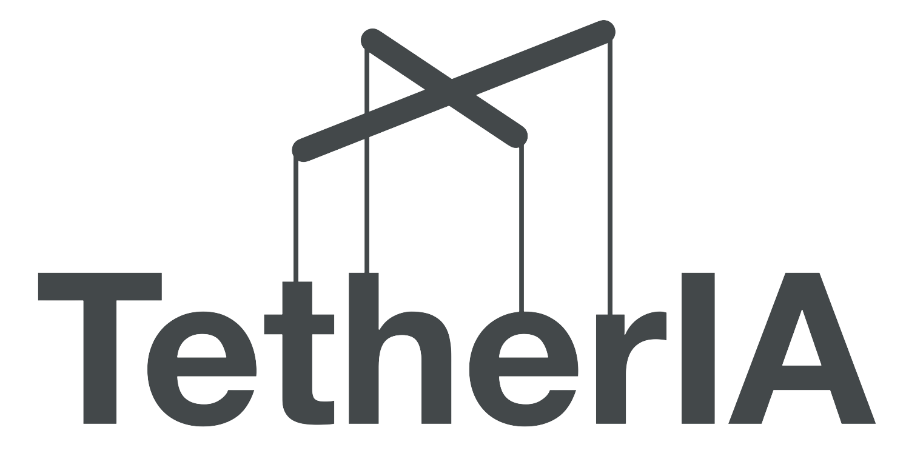

<p align="center">
  
  <br/><br/>
</p>

# Aero Hand Open Firmware v0.1.0 — README

A reference guide for building, flashing, using, and extending the **Aero Hand Open** firmware that runs on an ESP32‑S3 (Seeed Studio XIAO ESP32S3) and drives Feetech smart servos - Feetech HLS3606M.

**Note:** If you do not need advanced control over the actuator, you only need the `.bin` file from this repository. You can download the bin files from the `main/bin` folder , and use the GUI to upload them to your device. We recommend using the [aero-open-sdk](https://github.com/TetherIA/aero-open-sdk) to upload the firmware by running the aero-hand-gui.

---

## Table of Contents
- [1) Overview](#1-overview)
- [2) Repository Layout](#2-repository-layout)
- [3) Hardware & Software Requirements](#3-hardware--software-requirements)
- [4) Quick Start](#4-quick-start)
- [5) Firmware Architecture](#5-firmware-architecture)
- [6) Selecting LEFT vs RIGHT Hand at Build Time](#6-selecting-left-vs-right-hand-at-build-time)
- [7) Serial Protocol](#7-serial-protocol)
- [8) Homing Behavior](#8-homing-behavior)
- [9) Extending the Firmware with a New Command](#9-extending-the-firmware-with-a-new-command)
- [10) Code Reference (quick lookup)](#10-code-reference-quick-lookup)
- [11) Safety & Best Practices](#11-safety--best-practices)
- [12) Troubleshooting](#12-troubleshooting)
- [13) Contribution](#13-contribution)
- [14) License](#14-license)
- [15) Support](#15-Support)

---

## 1) Overview

The firmware exposes a compact **fixed 16‑byte binary serial protocol** so a host PC can command finger positions and query telemetry while the device handles **homing**, calibration, and basic safety on‑board.

**Major components**
- **`firmware_v0.1.0.ino`** — Main sketch: hardware init, serial command parser, periodic tasks, and command handlers.
- **`HandConfig.h`** — **Defines LEFT_HAND or RIGHT_HAND** (build‑time) to select the correct baseline calibration and channel directions.
- **`Homing.h` / `Homing.cpp`** — Implements the **homing** routine (`HOMING_start()` / `HOMING_isBusy()`), plus baseline tables and helpers.

**Servos / channels** (7):
1. Thumb CMC Abduction
2. Thumb CMC Flexion
3. Thumb Tendon (thumb curl/tendon drive)
4. Index
5. Middle
6. Ring
7. Pinky

---

## 2) Repository Layout

```
/main
  ├─ firmware_v0.1.0.ino          # main sketch
  ├─ HandConfig.h                 # LEFT_HAND / RIGHT_HAND selection
  ├─ Homing.h                     # homing API + ServoData type
  ├─ Homing.cpp                   # homing implementation + baselines
  └─ (libraries as needed)
```

---

## 3) Hardware & Software 

- **MCU**: Seeed Studio XIAO ESP32‑S3 (8 MB flash recommended)
- **Servos**: Feetech HLS3606M (IDs mapped to the 7 joints)
- **Power**: Power Servo rail at 6 with adequate current (Max Current up to 10A) , separate from USB 5 V
- **Tools**: [Arduino IDE](https://www.arduino.cc/en/software/) or PlatformIO.

---

## 4) Quick Start

### A. Select LEFT or RIGHT hand
In `HandConfig.h`, **define exactly one** of the following macros, or pass a build flag (see §6):
```c++
// #define LEFT_HAND
#define RIGHT_HAND
```

The choice selects the correct baseline calibration table at build time.

### B. Build & Flash
- **PlatformIO**: open the project, pick `seeed_xiao_esp32s3`, then **Upload**.
- **Arduino IDE**: open `firmware_v0.1.0.ino`, set Board to *XIAO ESP32S3*, then **Upload**.  
  **Note:** If you are using the Arduino IDE for the first time, you may need to install the ESP32 board support. Go to the Board Manager by pressing Ctrl+Shift+B, then search for "esp32". Find "esp32 by Espressif Systems" and install it. After installation, change the board under the Tools menu and select "XIAO_ESP32S3" from the list.

  

  


### C. First Boot
1. Connect USB, open a serial monitor at the project baud rate (e.g., 1,000,000 or 115,200 as configured - default 921600).
2. On Pressing Reset, Using the Serial monitor make sure that you receive OK from all 7 Servos.

---

## 5) Firmware Architecture

### 5.1 Data structures
- **`ServoData`**: per‑channel configuration `{grasp_count, extend_count, servo_direction}` used to map 16‑bit host commands into per‑servo raw counts (0..4095).
- **Baselines**: compile‑time constants for LEFT and RIGHT hands (7 entries each). A runtime working copy `sd[7]` is initialized from whichever baseline the build selects.

### 5.2 Homing module
- **`HOMING_start()`**: runs the homing routine for all 7 servos.
- **`HOMING_isBusy()`**: returns true while homing is in progress.
- **`resetSdToBaseline()`**: copies the correct baseline into the working array before homing.

### 5.3 Main loop
The main loop performs:
- USB serial polling
- Fast‑path command decode (see §7)
- Optional periodic telemetry sampling and printing

---

## 6) Selecting LEFT vs RIGHT Hand at Build Time

You can switch hands either by editing `HandConfig.h` **or** using build flags.

- **PlatformIO** (`platformio.ini`):
  ```ini
  [env:seeed_xiao_esp32s3]
  platform = espressif32
  board = seeed_xiao_esp32s3
  framework = arduino
  build_flags = -DRIGHT_HAND      ; or -DLEFT_HAND
  ```

- **Arduino IDE**: temporarily uncomment the macro in `HandConfig.h`.

> **Tip:** Keep the default checked into version control (usually `RIGHT_HAND`) and apply overrides via build flags in CI or per‑developer settings.

---

## 7) Serial Protocol

### 7.1 Frame format

### Frame Structure (TX and RX)
| Bytes     | Field            | Description                                                                 |
|-----------|-----------------|-----------------------------------------------------------------------------|
| 0         | **Opcode**      | Command / response code (e.g., `0x01` for HOMING, `0x04` for TRIM).         |
| 1         | **Filler**      | Always `0x00` (reserved for future use).                                    |
| 2..15     | **Payload**     | 14-byte payload. May contain parameters (channels, degrees, IDs, etc.) or be all zeros in acknowledgments. |

- **All commands from PC → firmware are 16 bytes.**  
- **All responses (ACKs) from firmware → PC are also 16 bytes.**

| Opcode | Name       | Direction | Payload (host→device unless noted)                                                        | Response (device→host)                                     |
| -----: | ---------- | --------- | ----------------------------------------------------------------------------------------- | ---------------------------------------------------------- |
| `0x01` | `HOMING`   | H→D       | 14 × `0x00`                                                                               | `[0x01,0x00, 14×0x00]` when complete                       |
| `0x02` | `SET_ID`   | H→D       | `new_id(u16)`, `current_limit(u16)`, rest zeros                                           | `[0x02,0x00, oldId(u16), newId(u16), curLim(u16), rest 0]` |
| `0x03` | `TRIM`     | H→D       | `channel(u16:0..6)`, `degrees(i16: ±360)`, rest zeros                                     | `[0x03,0x00, channel(u16), extendCount(u16), rest 0]`      |
| `0x11` | `CTRL_POS` | H→D       | **7×** `u16` (channels 0..6). Range `0..65535` maps to **extend→grasp** span per channel. | *(none)*                                                   |
| `0x12` | `CTRL_TOR` | H→D       | **Reserved / TBD**                                                                        | *(none)*                                                   |
| `0x22` | `GET_POS`  | H↔D       | 14×`0x00`                                                                                 | **7×** `u16` raw positions (counts 0..4095)                |
| `0x23` | `GET_VEL`  | H↔D       | 14×`0x00`                                                                                 | **7×** `u16` raw velocities                                |
| `0x24` | `GET_CURR` | H↔D       | 14×`0x00`                                                                                 | **7×** `u16` currents                                      |
| `0x25` | `GET_TEMP` | H↔D       | 14×`0x00`                                                                                 | **7×** `u16` temperatures (°C or raw, per build)           |

Version note: If your build used older experimental opcodes for SET_ID/TRIM, update those constants or adjust this table to match your firmware.

**7.2 Channel Map (0..6)**

0: Thumb CMC Abduction
1: Thumb CMC Flexion
2: Thumb Tendon (curl)
3: Index Finger
4: Middle Finger
5: Ring Finger
6: Pinky Finger 

**7.3 Position Mapping (host 16-bit → servo raw count)**

For each channel i, map host value u16[i] ∈ [0..65535] into raw servo counts using per-channel calibration:

span   = grasp_count[i] - extend_count[i]          // can be ±
raw32  = extend_count[i] + (u16[i] * span) / 65535
raw    = clamp(raw32, 0, 4095)

Direction is handled via servo_direction. Final writes use bus-batched SyncWrite (e.g., SyncWritePosEx) for all 7 servos.

**7.4 Persistence, Homing & Timing**

TRIM updates the extend endpoint for one channel and saves it in NVS (persists across reboots).

HOMING:

Loads baseline tables (LEFT/RIGHT per build flag).

Drives each joint to contact (current-based) to re-establish the open/extend reference.

Blocking: Other commands are ignored until homing finishes and the ACK is issued.

Typical full sequence can take up to ~25 seconds per channel (mechanics-dependent).

GUI “Set to Extend” is a function that sends CTRL_POS with all channels at extend (open). It’s not a separate opcode.

**7.5 Example Frames**

Homing (host→device, then device→host ACK):

```Payload
TX: 01 00 00 00 00 00 00 00 00 00 00 00 00 00 00 00
RX: 01 00 00 00 00 00 00 00 00 00 00 00 00 00 00 00
```

Set ID to 0x0003, current limit 1023 (0x03FF):
```Payload
TX: 02 00 03 00 FF 03 00 00 00 00 00 00 00 00 00 00
RX: 02 00 oldId_lo oldId_hi 03 00 FF 03 00 00 00 00 00 00 00 00
```

Trim channel 3 by −100° (0xFF9C):
```Payload
TX: 03 00 03 00 9C FF 00 00 00 00 00 00 00 00 00 00
RX: 03 00 03 00 ext_lo ext_hi 00 00 00 00 00 00 00 00 00 00
```

CTRL_POS (7 channels). Example: all open (0):
```Payload
TX: 11 00 00 00 00 00 00 00 00 00 00 00 00 00 00 00
(no ACK)
```

GET_TEMP → returns 7×u16 temps:
``` Payload
TX: 25 00 00 00 00 00 00 00 00 00 00 00 00 00 00 00
RX: 25 00 t0_lo t0_hi t1_lo t1_hi ... t6_lo t6_hi
```

**7.6 Bus Access & Robustness**

All sync-read/write paths use a semaphore (e.g., gBusMux) for bus locking to avoid collisions.

Unknown/invalid opcodes are safely ignored to preserve frame alignment.

During HOMING, handlers ignore incoming writes; queue them on the host side.

**7.7 Practical Tips**

Use modest rates (e.g., 50 Hz) for CTRL_POS during validation.

Ensure the servo supply can deliver peak current without droop.

If motion looks inverted, swap extend_count/grasp_count or adjust servo_direction.

To revert large trims, re-run HOMING to restore baselines.

---

## 8) Homing Behavior

The homing routine:
1. Loads the correct baseline via `resetSdToBaseline()`.
2. For each servo, **slowly drives towards a mechanical stop** while monitoring current (a “zero with current” approach).
3. Calibrates offset at contact, performs a small back‑off/settling motion, and finally moves to a defined **extend** posture for consistency across boots.

Timing, current limits, and per‑servo special cases (e.g., thumb tendon) are enforced internally to reduce stress on the mechanism.

> You can safely call `HOMING_start()` at any time from the serial command handler. While homing, ignore position writes or buffer them on the host side.

---

## 9) Extending the Firmware with a New Command

When you want to add a new feature (e.g., LED blink, torque enable/disable, save trim, etc.), follow this pattern:

### Step 1 — Add a new **control byte** (opcode)
At the top of `firmware_v0.1.0.ino`, define a unique `#define` or `static const uint8_t` value not already in use.
```c++
// Example: a simple LED or debug action
static const uint8_t OP_BLINK = 0x42;   // choose a free byte
```

### Step 2 — Implement a handler function
Keep the switch‑case light by moving logic into a small function.
```c++
static void handleBlink(uint8_t count) {
  for (uint8_t i = 0; i < count; ++i) {
    digitalWrite(LED_BUILTIN, HIGH);
    delay(80);
    digitalWrite(LED_BUILTIN, LOW);
    delay(80);
  }
}
```

### Step 3 — Add a `case` in the serial parser
Consume the payload as per use and call the function as per your handler.
```c++
case OP_BLINK: {
  uint8_t count = buf[1];                 // interpret first payload byte
  handleBlink(count);
  break;
}
```

### Step 4 — (Optional) Add a response
If the command should acknowledge or return data, write a 16‑byte response using the same framing convention (byte 0 = response opcode, byte 1 = 0x00, bytes 2..15 = payload).

### Step 5 — Update host tools
If you plan to use our aero-open-hand sdk then you might need to add that functionality under aero_hand.py file.

> **Naming tip:** Use `OP_*` for commands initiated by the host and `RX_*` or `OP_RSP_*` for device responses to avoid confusion.

---

## 10) Code Reference (quick lookup)

### Homing API
```c++
bool HOMING_isBusy();
void HOMING_start();
void resetSdToBaseline();
```

### Servo configuration
```c++
struct ServoData {     // one per channel
  uint16_t grasp_count;    // closed endpoint (raw 0..4095)
  uint16_t extend_count;   // open endpoint  (raw 0..4095)
  int8_t   servo_direction; // +1 or -1 direction convention
};
```

### Build‑time hand selection
```c++
// In HandConfig.h: define exactly one
// #define LEFT_HAND
// #define RIGHT_HAND
```

---

## 11) Safety & Best Practices
- Start with **low speeds/torque** when testing new code.
- Ensure the servo supply can deliver peak current without large droops.
- Keep cable lengths short and bus terminations clean; avoid ground loops.
- Avoid sending high‑rate position frames during homing.

---

## 12) Troubleshooting
- **Wrong hand geometry**: Verify your build flags (`-DLEFT_HAND` vs `-DRIGHT_HAND`).
- **Servos drive the wrong way**: Check `servo_direction` for the affected channel or swap extend/grasp counts.
- **Homing stalls**: Inspect current limits/timeouts; make sure mechanics move freely.
- **No serial activity**: Confirm port, baud rate, and that frames are exactly 16 bytes with the correct opcode.

---

## 13) Contribution
We welcome community contributions!

If you would like to improve the Firmware or add new features:

1. Fork and create a feature branch.
2. Add or modify opcodes and handlers as described in Section 9.
3. Include brief unit/bench tests where possible.
4. Commit your changes with clear messages.
5. Push your branch to your fork.
6. Open a PR with a summary and scope of changes.

---

## 14) License
This project is licensed under **Apache License 2.0**

---

## 15) Support 
If you encounter issues or have feature requests:
- Open a [GitHub Issue](https://github.com/TetherIA/aero-open-sdk/issues)
- Contact us at **contact@tetheria.ai**

---

<div align="center">
**Happy building!** Try something new, break things safely, and share what you learn.
If you find this project useful, please give it a star! ⭐

Built with ❤️ by TetherIA.ai
</div>